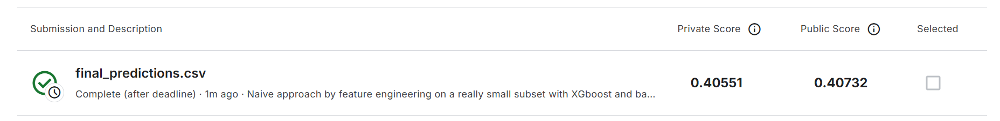

# Avazu Click-Through Rate Prediction

This project focuses on predicting click-through rates (CTR) using the Avazu dataset from Kaggle. The model leverages **XGBoost** combined with **bagging** to improve robustness and reduce overfitting. Feature Engineering and extensive **hyperparameter tuning** was performed to optimize performance.

## Features

- Uses gradient boosting (XGBoost) for powerful prediction
- Implements bagging ensemble technique for variance reduction
- Fine-tunes hyperparameters with grid/random search
- Evaluated on Kaggle’s CTR prediction challenge dataset

## Usage

1. Prepare the Avazu dataset.
2. Run the training script with chosen hyperparameters.
3. Generate predictions and submit to Kaggle.

## Results

Here is my Kaggle score:

## Requirements

- Python 3.x
- xgboost
- scikit-learn
- pandas
- numpy
